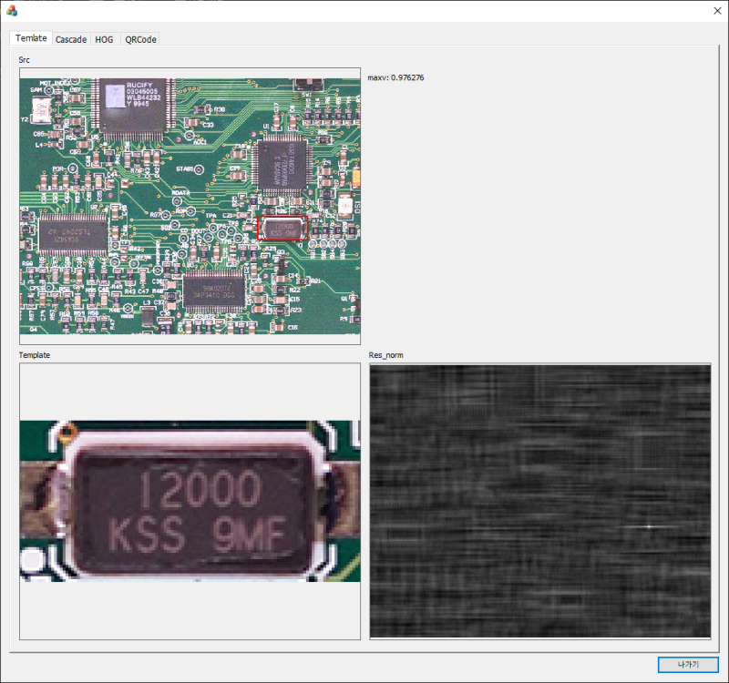
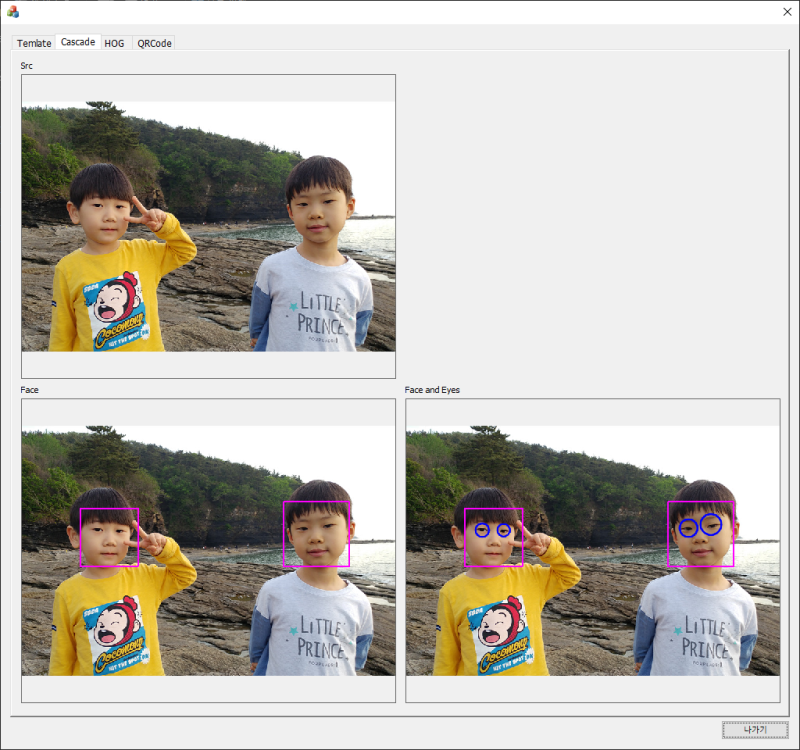
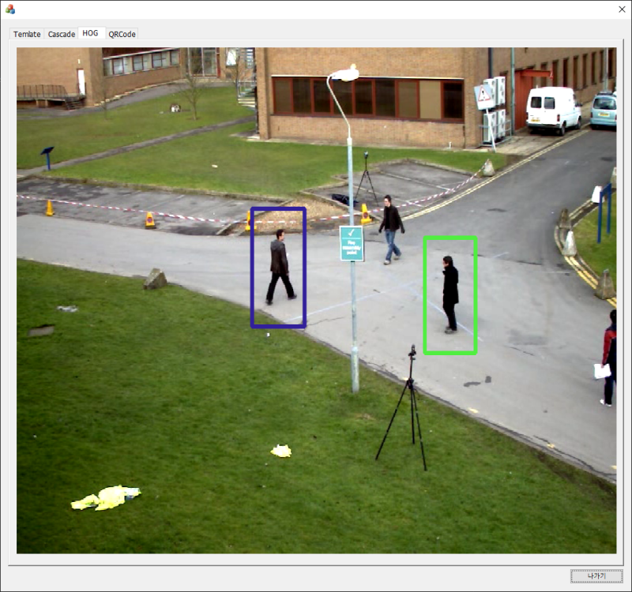
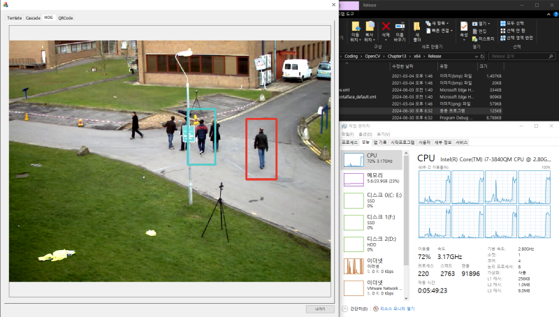

# GilbutOpenCV4_Chapter13
길벗OpenCV4 Chapter13 (예제통합) [2025-0721_1822]
 
 
* **[구글 드라이브에서 전체 프로젝트 다운로드]([여기에_링크_붙여넣기](https://drive.google.com/file/d/1k1p-m5qz3zMmbgHrbI6gEj4rAPZ0vGkc/view?usp=drive_link))**
* **[📥 전체 프로젝트 및 리소스 다운로드 (680MB)](https://drive.google.com/file/d/1k1p-m5qz3zMmbgHrbI6gEj4rAPZ0vGkc/view?usp=drive_link)**

### 🛠️ 실행 환경
* **IDE:** Visual Studio 2022

MFC 로 작성된 프로그램
OpenCV 라이브러리를 설정해 놓은 상태
OpenCV 4.12.0 기준으로 작성됨

2025-0721
최신 OpenCV는 4.12.0 이고
최신으로 실행시 관련 dll 도 바꾸어 준 상태
gdi 관련 스마트 포인터와 gdi 자동해제 적용 상태
스마트 포인터로 queue 에 MAT 저장 관련 로직 강화

qrCode 텝은 카메라가 있어야 되고
카메라가 인식한 qrCode의 문자열을 화면에 표시함

실행만 볼려면 Release 폴더에 실행파일이 존재함

주요내용
화면에 그림 또는 동영상을 표시해 주는
class 를 작성함 (CMy 로 시작되는 클래스임)
작성한 클래스로 이미지를 표시하고
동영상 재생시 Cpu 스레드의 반 만큼 스레드를 생성하여 이미지 처리에 사용하고
동영상 화면에 출력시 홀짝 스레드(2개)로 번갈아가며 화면 출력
queue에 처리된 이미지의 데이터 가 있고
queue에 접근할때는 [임계영역]을 사용해서 스레드의 데드락이나 오류를 방지함
동영상 재생이 아니라면 cpu 사용을 하지 않게 막음(탭 이동으로 이미지 표시시 동영상 일시 중지)
결론: 단일 스레드 보단 동영상 재생시 cpu 부하가 적음

Debug 실행 파일은 동영상 재생이 아주 느림... 이건 release 상태의 파일은 정상적인 속도로 나옴

 
 
 
 
