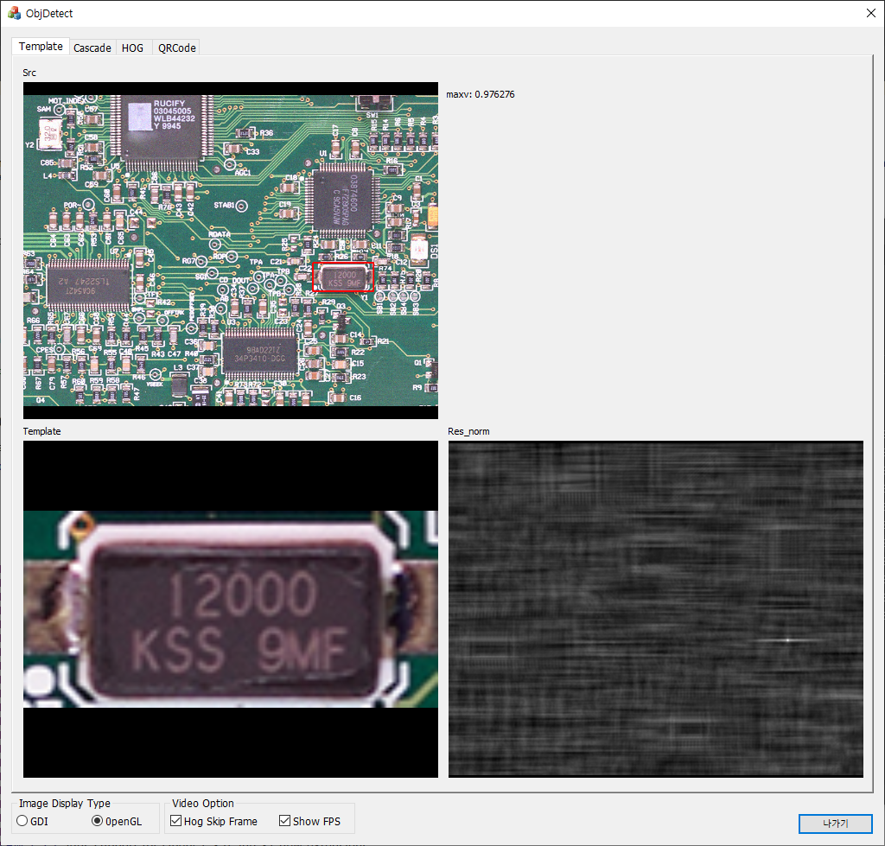
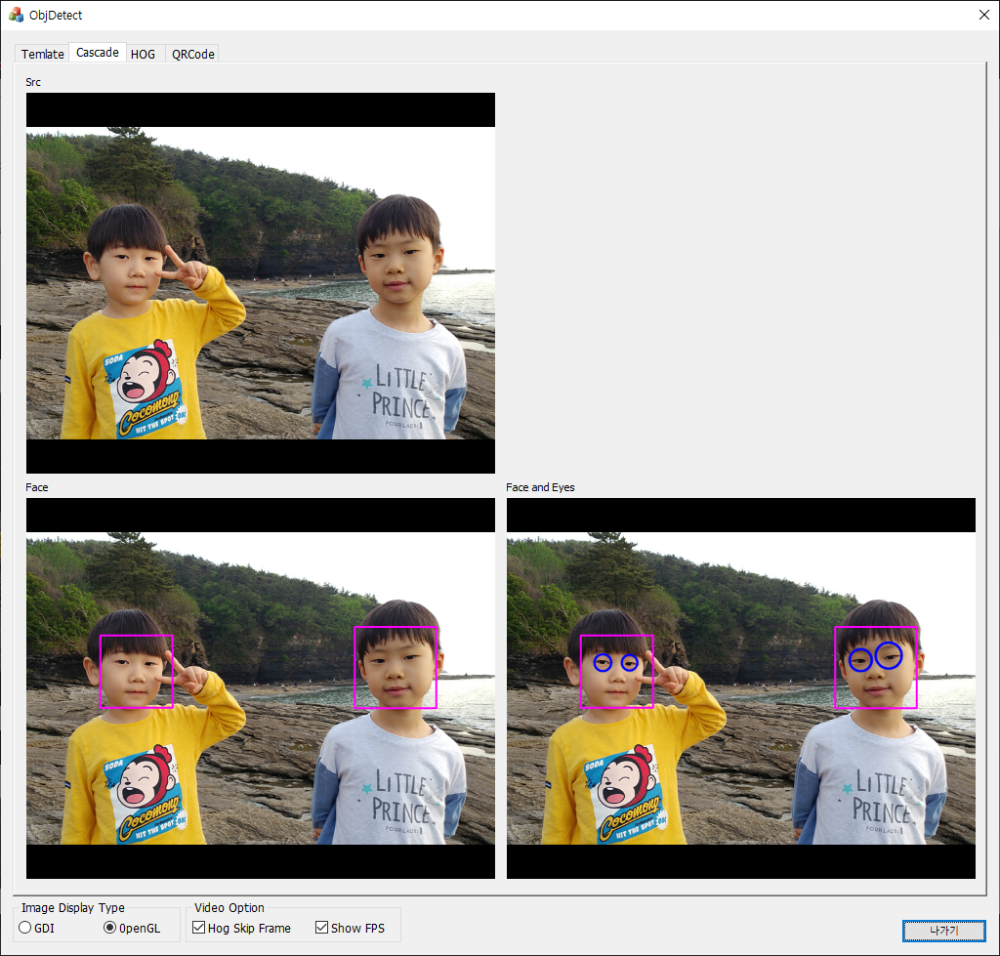
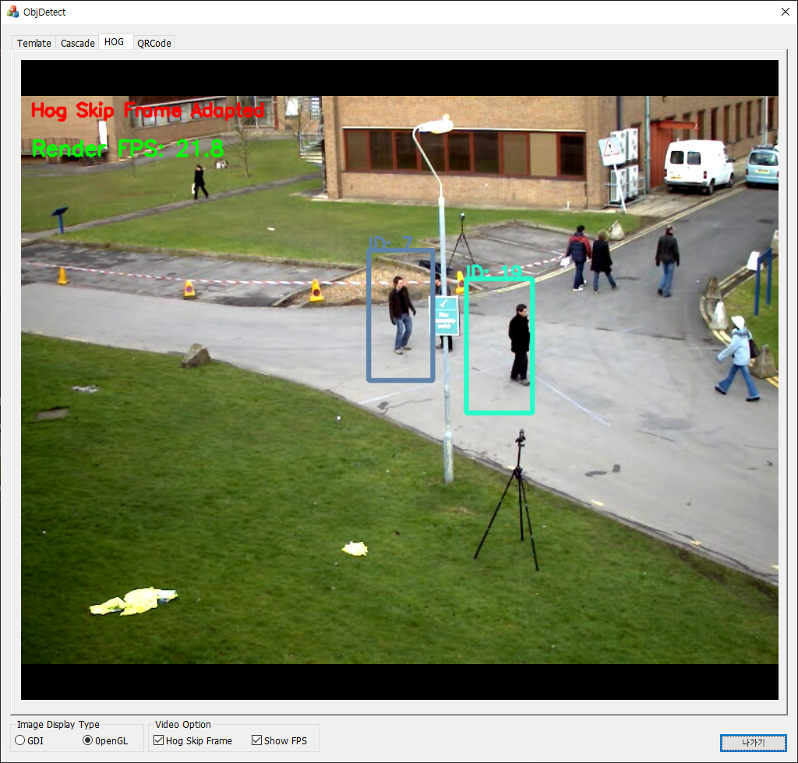
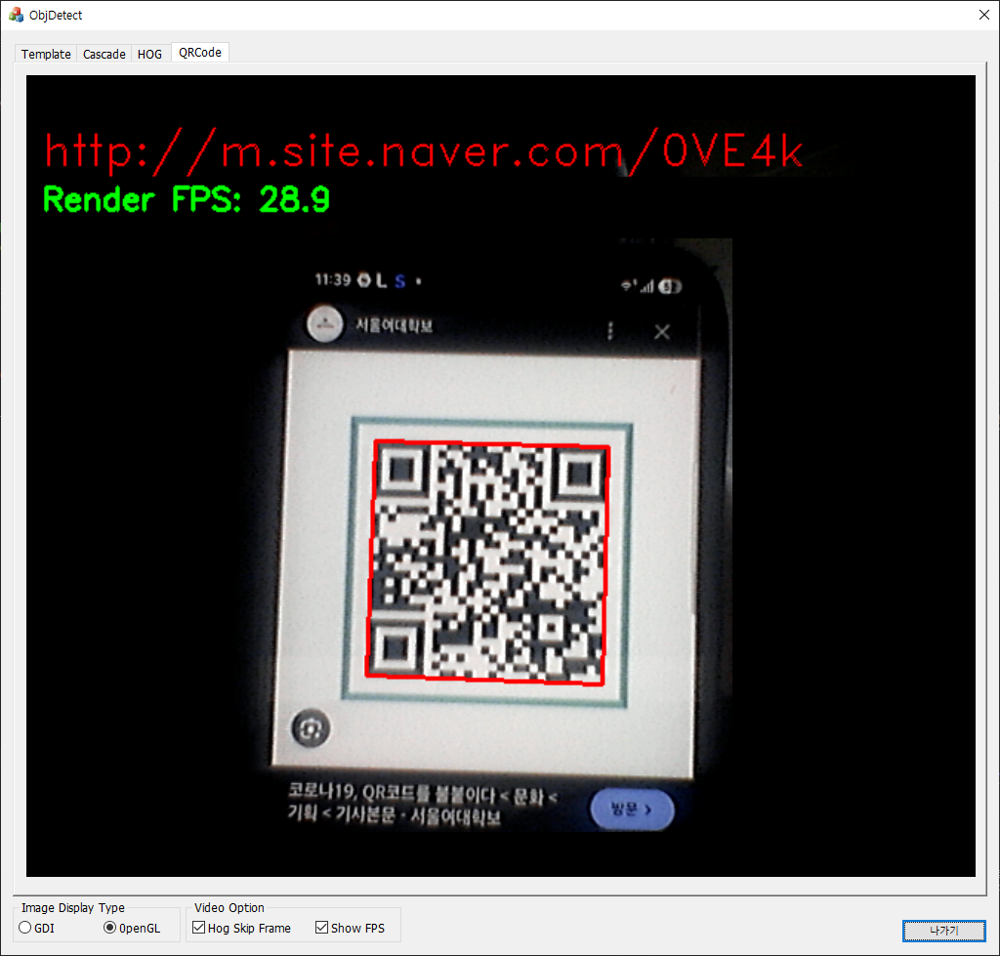

# GilbutOpenCV4_Chapter13
<<<<<<< HEAD
길벗OpenCV4 Chapter13 (예제통합) [2026-0518_2115]
 
* **[📥 전체 프로젝트 및 리소스 다운로드 (696MB)](https://drive.google.com/file/d/1iydggtPXza4Fo9g4X5u_NP_CtDLbZLkD/view?usp=drive_link)**
=======
 
### 🛠️ 실행 환경
* **IDE:** Visual Studio 2022 
 
MFC 로 작성된 프로그램 
OpenCV 라이브러리를 설정해 놓은 상태 
OpenCV 4.12.0 기준으로 작성됨 
 
2025-0721 
최신 OpenCV는 4.12.0 이고 
최신으로 실행시 관련 dll 도 바꾸어 준 상태 
gdi 관련 스마트 포인터와 gdi 자동해제 적용 상태 
스마트 포인터로 queue 에 MAT 저장 관련 로직 강화 
 
2026-0515 
화면 출력에 0penGL 을 적용(glew사용) 
	COpenGLControl 클래스로 OpenGL 화면 출력 
	[코드 수정으로 이전의 Gdi 출력도 가능] 
HOG 동영상 트래킹 로직 개선 
 
2026-0518 
Gdi 또는 OpenGL 출력 선택 가능 UI 적용 
 
2026-0606 
Hog Skip Frame 적용(저사양 PC에서 Hog 계산 특정 Frame Skip 기능) 
Render FPS 표시(FPS 표시로 Hog 적용에 의한 프레임 확인 가능) 
std::condition_variable 이벤트 동기화 기법 적용(동기화 최적화): Sleep() 사용 최소화 시킴 
동적 할당을 스마트 포인터로 교체 
동영상 재생 스레드 로직을 교체(초기화시 한번 스레드를 생성하고 동영상 반복시 기존 스레드에서 계속 재생 진행) 
 
 
qrCode 텝은 카메라가 있어야 되고 
카메라가 인식한 qrCode의 문자열을 화면에 표시함(컴퓨터 카메라에 휴대폰 화면의 QR코드를 띄어 URL 표시가능) 
 
실행만 볼려면 Release 폴더에 실행파일이 존재함 
 
 
주요내용 
화면에 그림 또는 동영상을 표시해 주는 
class 를 작성함 (CMy 로 시작되는 클래스임) 
작성한 클래스로 이미지를 표시하고 
동영상 재생시 Cpu 스레드의 반 만큼 스레드를 생성하여 이미지 처리에 사용하고 
동영상 화면에 출력시 홀짝 스레드(2개)로 번갈아가며 화면 출력 
queue에 처리된 이미지의 데이터 가 있고 
queue에 접근할때는 [임계영역]을 사용해서 스레드의 데드락이나 오류를 방지함 
동영상 재생이 아니라면 cpu 사용을 하지 않게 막음(탭 이동으로 이미지 표시시 동영상 일시 중지) 

결론: 단일 스레드 보단 동영상 재생시 cpu 부하가 적음 
 
Debug 실행 파일은 동영상 재생이 아주 느림... 이건 release 상태의 파일은 정상적인 속도로 나옴 
 
결론: 단일 스레드 보단 동영상 재생시 cpu 부하가 적음
  
Debug 실행 파일은 동영상 재생이 아주 느림... 이건 release 상태의 파일은 정상적인 속도로 나옴  

 
 
 
 
